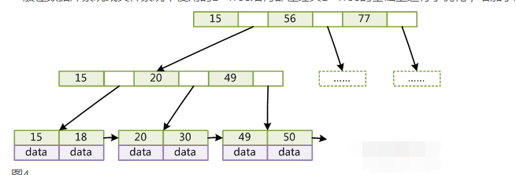

# InnoDB索引

### 数据结构

为何几乎没有数据库索引使用二叉查找树或其进化品种红黑树来实现？而是使用 B-Tree 或 B+Tree 作为索引结构。 

B+Tree 是 B-Tree 的一个变种。

B+Tree 内节点只存储索引字段，数据内容都会在叶子节点上存储。

为了提高区间访问的性能，叶子节点增加了指向相邻叶子节点的指针，可以顺序访问。

**对比**

数据库索引占用空间很大，不能全部存储在内存中，只能以索引文件的方式存储在磁盘上。

磁盘 I/O 的开销很大，所以为了提高检索性能，索引的数据结构设计一定要减少磁盘 I/O 的次数。

操作系统读取磁盘数据时，会根据局部性原理，对进行磁盘预读，预读的长度一般为页（page）的整数倍。

> 局部性原理：当一个数据被用到时，通常其附近的数据也会马上被使用。
>
> 页：许多操作系统中，页得大小通常为 4KB。

利用了磁盘预读原理，将一个节点的大小设为等于一个页，每个节点只需一次 I/O。新建节点时，直接申请一个页的空间，
进行顺序存储。

B+Tree 查询时，检索次数为 h-1 次 I/O。对比红黑树，B+Tree 高度更低。所以作为索引结构效率很高。

**主索引**

InnoDB 的数据文件本身就是索引文件,索引的 key 是数据表的主键。如果没有显示指出，MySQL 会自动生成一个隐含字段作为主键。
字段为长度 6 字节的长整型。

辅助索引存储的数据值，为主键的值，而不是数据的地址。

当使用辅助索引检索时，会需要检索两遍索引：先检索辅助索引获得主键，然后用主键到主索引中检索获得记录。

由于上面的特性，当设置主键时，最好使用自增 Id，一定要避免主键过长。

**主键选择**

InnoDB 使用聚集索引，数据记录本身被存于主索引（一颗B+Tree）的叶子节点上。

使用自增主键，那么每次插入新的记录，记录就会顺序添加到当前索引节点的后续位置，
当页满时，就会自动开辟一个新的页。

> 如果页面达到装载因子（InnoDB默认为15/16），则开辟一个新的页（节点）。

使用非自增主键(身份证号或学号)，每次插入主键的值近似于随机，为了找到合适的插入位置，
会造成频繁的移动、分页，也会有大量的碎片产生，得到了不够紧凑的索引结构。

因此，只要可以，请尽量在InnoDB上采用自增字段做主键。

**索引**

最左前缀索引

前缀索引

索引的选择性(不重复的索引值与与表记录数比值)

**参考**

[MySQL索引背后的数据结构与算法](https://www.kancloud.cn/kancloud/theory-of-mysql-index/41849)

[阿里面试](https://zhuanlan.zhihu.com/p/78982303)

