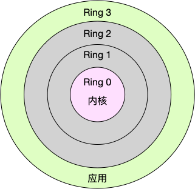
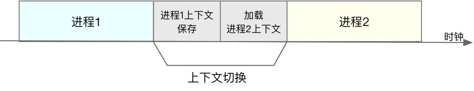

# CPU 上下文切换

### 简介

CPU 上下文切换会导致系统的负载升高，占用 CPU 资源。

Linux 是一个多任务操作系统，它支持远大于 CPU 数量的任务同时运行。
当然，这些任务实际上并不是真的在同时运行，而是因为系统在很短的时间内，
将 CPU 轮流分配给它们，造成多任务同时运行的错觉。

CPU 都需要知道任务从哪里加载、又从哪里开始运行，也就是说，需要系统事先帮它设置好 CPU 寄存器和程序计数器（Program Counter，PC）。

`CPU 寄存器`，是 CPU 内置的容量小、但速度极快的内存。而`程序计数器`，则是用来存储 CPU 正在执行的指令位置、或者即将执行的下一条指令位置。
它们都是 CPU 在运行任何任务前，必须的依赖环境，因此也被叫做 `CPU 上下文`。

**上下文切换**

CPU 上下文切换，就是先把前一个任务的 CPU 上下文（也就是 CPU 寄存器和程序计数器）保存起来，
然后加载新任务的上下文到这些寄存器和程序计数器，最后再跳转到程序计数器所指的新位置，运行新任务。

保存下来的上下文，会存储在系统内核中，并在任务重新调度执行时再次加载进来。这样就能保证任务原来的状态不受影响，让任务看起来还是连续运行。

CPU 的上下文切换的场景

> 进程上下文切换;
>
> 线程上下文切换;
>
> 中断上下文切换。

上下文切换也分为自愿和非自愿的。

### 进程上下文切换

Linux 按照特权等级，把进程的运行空间分为内核空间和用户空间，分别对应着下图中， CPU 特权等级的 Ring 0 和 Ring 3。

> 内核空间（Ring 0）具有最高权限，可以直接访问所有资源；
>
> 用户空间（Ring 3）只能访问受限资源，不能直接访问内存等硬件设备，必须通过系统调用陷入到内核中，才能访问这些特权资源。

进程在用户空间运行时，被称为进程的用户态，而陷入内核空间的时候，被称为进程的内核态。

从用户态到内核态的转变，需要通过系统调用来完成。系统调用也进行了 CPU 上下文切换

**系统调用**

CPU 寄存器里原来用户态的指令位置保存，更新为内核态指令新位置，然后跳转执行。
 
系统调用结束后，寄存器恢复原来用户态指令，切换到用户空间，一次系统调用，发送两次 CPU 上下文切换。

系统调用过程中一直是同一个进程在运行，不涉及用户态资源的切换，也不会切换进程。

系统调用过程通常称为特权模式切换，而不是上下文切换。

**进程切换**

进程的上下文切换，保存当前进程的内核状态(堆栈)和 CPU 寄存器之前，需要先把该进程的虚拟内存、栈、全局变量等保存下来；然后加载下一个进程。

每次切换消耗几十纳秒到数微秒的 CPU 时间，在进程上下文切换次数较多的情况下，很容易导致 CPU 将大量时间耗费在寄存器、
内核栈以及虚拟内存等资源的保存和恢复上，进而大大缩短了真正运行进程的时间。

除了内核栈、寄存器指针、虚拟内存、栈、全局变量等。虚拟内存更新后，还需要刷新TLB(虚拟内存映射)，内存访问也会变慢，还影响多进程共享缓存。

> 进程切换间接开销，由于各种缓存并不热，速度运行会慢一些。
> 如果进程始终都在一个CPU上调度还好一些，如果跨CPU的话，之前热起来的TLB、L1、L2、L3因为运行的进程已经变了，
> 所以以局部性原理cache起来的代码、数据也都没有用了，导致新进程穿透到内存的IO会变多。

**进程调度**

Linux 为每个 CPU 都维护了一个就绪队列，将活跃进程（即正在运行和正在等待 CPU 的进程）按照优先级和等待 CPU 的时间排序，然后选择最需要 CPU 的进程，也就是优先级最高和等待 CPU 时间最长的进程来运行。

触发进程调度场景

> 时间片耗尽了，就会被系统挂起。
>
> 系统资源不足（比如内存不足）时，被挂起。
>
> 睡眠函数 sleep，主动挂起。
>
> 被高优先级进程抢占。
>
> 硬件中断，执行中断进程。

### 线程上下文切换

线程是调度的基本单位，而进程则是资源拥有的基本单位。

进程给线程提供了虚拟内存、全局变量等资源。

**线程切换**

不同进程线程切换。此时，因为资源不共享，所以切换过程就跟进程上下文切换是一样。

同一个进程线程切换。此时，因为虚拟内存是共享的，所以在切换时，虚拟内存这些资源就保持不动，
只需要切换线程的私有数据(栈、寄存器)等不共享的数据。

程内的线程切换，要比多进程间的切换消耗更少的资源，而这，也正是多线程代替多进程的一个优势。

### 中断上下文切换

为了快速响应硬件的事件，中断处理会打断进程的正常调度和执行，转而调用中断处理程序，响应设备事件。而在打断其他进程时，
就需要将进程当前的状态保存下来，这样在中断结束后，进程仍然可以从原来的状态恢复运行。

中断不涉及用户态，中断发送时，不需要保存用户态资源。只需要切换CPU 寄存器、内核堆栈、硬件中断参数等。

对同一个 CPU 来说，中断处理比进程拥有更高的优先级。

**参考**

[Linux 性能优化实战-极客时间](https://time.geekbang.org/column/article/70077?code=L6RL-eocu27wznXuQuV7XXvNA01tPBYxsdUgLU6wRLI%3D)

[进程/线程上下文切换会用掉你多少CPU？](https://zhuanlan.zhihu.com/p/79772089)

[协程究竟比线程能省多少开销？](https://zhuanlan.zhihu.com/p/80037638)
