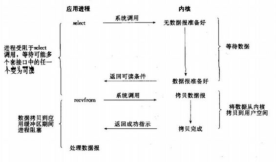
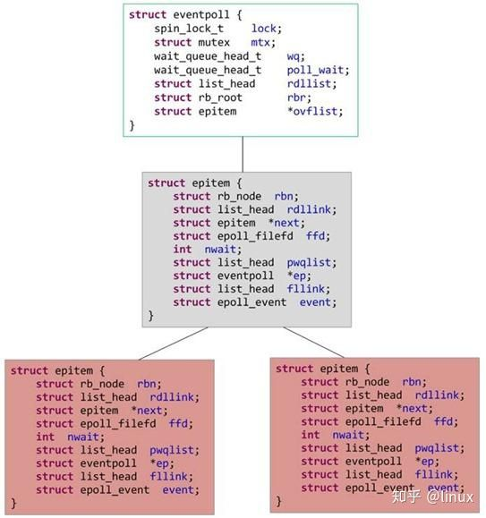
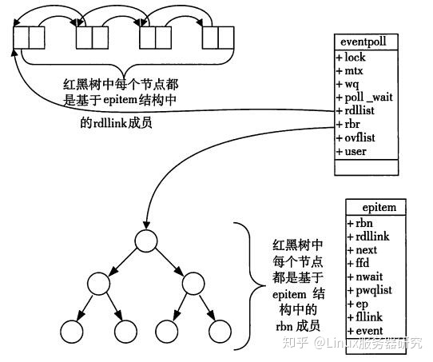
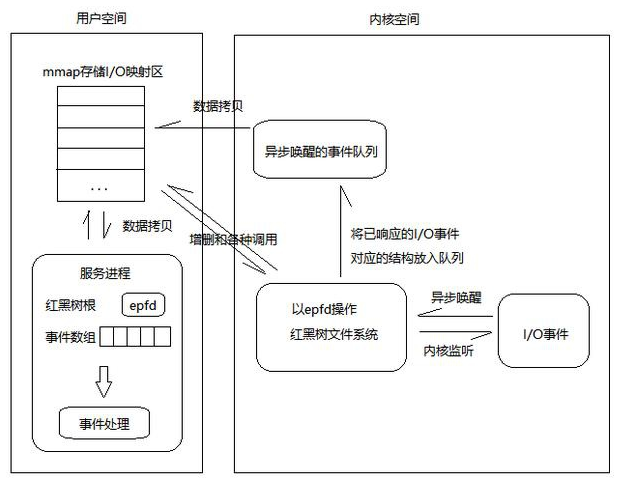
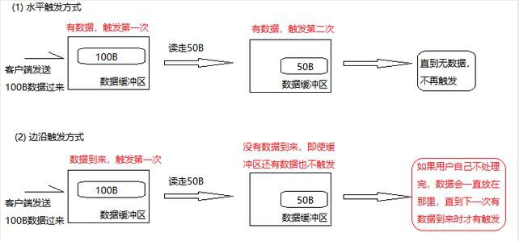

# I/O 多路复用

Q：什么是多路复用？

> 一个进程监听多个文件描述符。

Linux 支持 I/O 多路复用的系统调用有 select、poll、epoll，这些调用都是内核级别的。但 select、poll、epoll 本质上都是同步I/O，
先是 block 住等待就绪的 socket，再 block 住将数据从内核拷贝到用户内存空间。socket 是非阻塞的，进程由 select、poll、epoll 函数进行了阻塞。



Q：什么是 C10k 问题。

> C10K 问题本质上是操作系统处理大并发请求的问题。对于 Web 时代的操作系统而言，对于客户端过来的大量的并发请求，
> 需要创建相应的服务进程或线程。这些进程或线程多了，导致数据拷贝频繁（缓存 I/O、内核将数据拷贝到用户进程空间、阻塞），
> 进程 / 线程上下文切换消耗大，从而导致资源被耗尽而崩溃。这就是 C10K 问题的本质。

I/O 多路复用就是用来解决 C10k 的问题。

## select

select 是用于 I/O 多路转接的一个系统调用函数。

在 C 程序中，该系统调用在 sys/select.h 或 unistd.h 中声明，语法如下：

```
int select(int nfds, fd_set* readfds, fd_set* writefds, fd_set* errorfds, struct timeval* timeout);
```
nfds：sets的文件描述符的最大值;readfds、writefds、writefd、serrorfds：fd_set类型，分别是可读、可写、出错描述符；
timeout：表示等待检查完成的最长时间

为了维护 fd_set 类型的参数，会使用下面四个宏：FD_SET(), FD_CLR(), FD_ZERO() 和 FD_ISSET()。

```
FD_ZERO(int fd, fd_set* fds)   //清空集合
FD_SET(int fd, fd_set* fds)    //将给定的描述符加入集合
FD_ISSET(int fd, fd_set* fds)  //判断指定描述符是否在集合中
FD_CLR(int fd, fd_set* fds)    //将给定的描述符从文件中删除
```

**实例代码**

```cgo
#define DEFAULT_PORT 6666
...
// 监控文件描述符集合  位图
fd_set client_fdset;

// 监控文件描述符中最大的文件号
int maxsock;

// 超时返回时间
struct timeval tv;

// 存放活动的sockfd
int client_sockfd[5];

bzero((void*)client_sockfd, sizeof(client_sockfd));

// 用来记录描述符数量
int conn_amount = 0;
maxsock = serverfd;
char buffer[1024];
int ret = 0;

while(1) {
    // 初始化文件描述符到集合
    FD_ZERO(&client_fdset);
    // 加入服务器描述符
    FD_SET(serverfd, &client_fdset);
    // 设置超时时间 30s
    tv.tv_sec = 30;
    tv.tv_usec = 0;

    // 把活动的句柄加入到文件描述符中
    for(int i = 0; i < 5; ++i) {
        if(client_sockfd[i] != 0) {
            FD_SET(client_sockfd[i], &client_fdset);
        }
    }

    // select
    ret = select(maxsock+1, &client_fdset, NULL, NULL, &tv);
    if(ret < 0) {
        perror("select error!\n");
        break;
    } 
    else if(ret == 0) {
        printf("timeout\n");
        continue;
    }
    // 轮询各个文件描述符
    for(int i = 0; i < conn_amount; ++i) {
        if(FD_ISSET(client_sockfd[i], &client_fdset)) {
            // FD_ISSET检查是否有消息
            printf("start recv from client[%d]\n", i);
            ret = recv(client_sockfd[i], buffer, 1024, 0);
            if(ret <= 0) {
                printf("client[%d] close\n", i);
                close(client_sockfd[i]);
                FD_CLR(client_sockfd[i], &client_fdset);
                client_sockfd[i] = 0;
            }
            else {
                printf("recv from client[%d]: %s\n", i, buffer);
            }
        }
    }
    // 检查是否有新的连接，如果有，接收连接，加入到client_sockfd
    if(FD_ISSET(serverfd, &client_fdset)) {
       ...
    }
    for(int i = 0; i < 5; ++i) {
    if(client_sockfd[i] != 0) {
            close(client_sockfd[i]);
        }
    }
    close(serverfd);
    return 0;
}
```

client_fdset 是 bitmap 数据类型，用于标记要监听的 client_sockfd，默认是 1024 大小，限制标记 1024 个 fd(文件描述符)。
且每次循环时，都需要重置 client_fdset。

当有消息或超时时，select 不再阻塞，client_fdset 会把有消息的文件描述符对应的 bit 置为 1。此时需要把 fd 
集合从用户态拷贝到内核态，开销在 fd 很多时会很大。

处理消息时，需要循环集合中的每个 fd 进行判断。

**缺点**

> client_fdset 默认是1024，并发太小。
>
> client_fdset 不可重用，每次需要重置，带来额外开销。
>
> 内核态转换到用户态拷贝，有很多开销。
>
> 有消息是，需要遍历所有的 fd。


## poll

和 select 函数一样，poll函数也可以用于执行多路复用 IO。

```cgo
int poll(struct pollfd* fds, unsigned int nfds, int timeout);
```

与 select 不同的是 poll 针对 client_fdset 进行了改造，变成 pollfd 结构体，不再有 fd 数量的限制。

```cgo
struct pollfd {
    int fd;         // 文件描述符
    short events;   // 等待的事件
    short revents;  // 实际发生了的事件
};
```

**实例代码**

```cgo
int connfd, sockfd;
struct sockaddr_in client_addr;
socklen_t client_addrlen;
struct pollfd clientfds[OPEN_MAX];
int maxI, i, nready;

// 添加监听描述符
clientfds[0].fd = listenfd;
clientfds[0].events = POLLIN;

// 初始化客户连接描述符
for(i = 1; i < OPEN_MAX; ++i)   clientfds[i].fd = -1;
maxI = 0;

while(1) {
    // 获取可用描述符的个数,无限超时
    nready = poll(clientfds, maxI + 1, INFTIM);
    if(nready == -1) {
        perror("poll error:");
        exit(1);
    }

    // 测试监听描述符是否准备好
    if(clientfds[0].revents & POLLIN) {
        client_addrlen = sizeof(client_addr);

        // 接受新的连接
        if((connfd = accept(listenfd, (struct sockaddr*)&client_addr, &client_addrlen)) == -1) {
            if(errno == EINTR)  continue;
            else {
                perror("accept error:");
                exit(2);
            }
        }

        fprintf(stdout, "accept a new client: %s:%d\n", inet_ntoa(client_addr.sin_addr), client_addr.sin_port);

        // 将新的连接描述符添加到数组中
        for(i = 1; i < OPEN_MAX; ++i) {
            if(clientfds[i].fd < 0) {
                clientfds[i].fd = connfd;
                break;
            }
        }
        ...

        // 将新的描述符添加到读描述符集合中
        clientfds[i].events = POLLIN;

        maxI = i > maxI ? i : maxI;
        if(--nready <= 0)   continue;
    }
    // 处理多个连接上客户端发来的包
    char buffer[MAXLINE];
    bzero(buffer, MAXLINE);
    int readlen = 0;
    for(i = 1; i <= maxI; ++i) {
        if(clientfds[i].fd < 0) continue;
        // 测试客户描述符是否准备好
        if(clientfds[i].revents & POLLIN) {
            // 接受客户端发送的信息
            readlen = read(clientfds[i].fd, buffer, MAXLINE);
            ...
        }
    }
}
```

pollfd 不再有大小的限制，当有消息时，只会把 pollfd 的字段 revents 置为 1。 clientfds 不需要每次都进行重置。

相对于 select ，poll 解决了连接数限制及循环重置的问题。其他的问题，poll 并没有解决。


## epoll

epoll是Linux内核的可扩展I/O事件通知机制。于 Linux 2.5.44首度登场，它设计目的旨在取代 select 与 poll 系统函数。
让需要大量操作文件描述符的程序得以发挥更优异的性能。在高并发场景，随着文件描述符的增长，有良好的可扩展性。

> select 与 poll 时间复杂度为 O(n);
> 
> epoll的时间复杂度 O(log n)。

epoll 实现的功能与 poll 类似，都是监听多个文件描述符上的事件。`nginx`、`redis`、`java NIO(Linux)` 都是用 `epoll` 模型进行实现的。

epoll 与 FreeBSD 的 kqueue 类似，底层都是由可配置的操作系统内核对象建构而成，并以文件描述符(file descriptor)的形式呈现于用户空间。epoll 通过使用红黑树(RB-tree)搜索被监控的文件描述符。

在 epoll 实例上注册事件时，epoll 会将该事件添加到 epoll 实例的红黑树上并注册一个回调函数，当事件发生时会将事件添加到就绪链表中。

在 Linux 系统下，可以查看到用户能注册到epoll实例中的最大文件描述符的数量限制。

```
[root@centos7 note]# cat /proc/sys/fs/epoll/max_user_watches
789913
```


**epoll_event 数据结构**

```cgo
typedef union epoll_data
{
  void *ptr;
  int fd;               /* 建立连接的文件描述符 */
  uint32_t u32;
  uint64_t u64;
} epoll_data_t;

struct epoll_event
{
  uint32_t events;      /* Epoll events */ 事件宏
  epoll_data_t data;    /* User data variable */
};
```

**事件宏**

> EPOLLIN ： 表示对应的文件描述符可以读（包括对端SOCKET正常关闭）；
>
> EPOLLOUT： 表示对应的文件描述符可以写；
>
> EPOLLPRI： 表示对应的文件描述符有紧急的数据可读（这里应该表示有带外数据到来）；
>
> EPOLLERR： 表示对应的文件描述符发生错误；
>
> EPOLLHUP： 表示对应的文件描述符被挂断；
>
> EPOLLET： 将 EPOLL设为边缘触发(Edge Triggered)模式（默认为水平触发），这是相对于水平触发(Level Triggered)来说的。
>
> EPOLLONESHOT： 只监听一次事件，当监听完这次事件之后，如果还需要继续监听这个socket的话，需要再次把这个socket加入到EPOLL队列里

**程序接口**

```
int epoll_create(int size);
```

在内核中创建epoll实例并返回一个epoll文件描述符。 在最初的实现中，调用者通过 size 参数告知内核需要监听的文件描述符数量。如果监听的文件描述符数量超过 size, 则内核会自动扩容。而现在 size 已经没有这种语义了，但是调用者调用时 size 依然必须大于 0，以保证后向兼容性。

```
int epoll_ctl(int epfd, int op, int fd, struct epoll_event *event);
```

向 epfd 对应的内核epoll 实例添加、修改或删除对 fd 上事件 event 的监听。op 可以为 EPOLL_CTL_ADD, EPOLL_CTL_MOD, EPOLL_CTL_DEL 分别对应的是添加新的事件，修改文件描述符上监听的事件类型，从实例上删除一个事件。如果 event 的 events 属性设置了 EPOLLET flag，那么监听该事件的方式是边缘触发。

```
int epoll_wait(int epfd, struct epoll_event *events, int maxevents, int timeout);
```
当 timeout 为 0 时，epoll_wait 永远会立即返回。而 timeout 为 -1 时，epoll_wait 会一直阻塞直到任一已注册的事件变为就绪。当 timeout 为一正整数时，epoll 会阻塞直到计时 timeout 毫秒终了或已注册的事件变为就绪。因为内核调度延迟，阻塞的时间可能会略微超过 timeout 毫秒。


**实例代码**

```cgo
#define MAX_EVENTS 10
struct epoll_event ev, events[MAX_EVENTS];
int listen_sock, conn_sock, nfds, epollfd;

/* Code to set up listening socket, 'listen_sock',
  (socket(), bind(), listen()) omitted */

epollfd = epoll_create(1);          /* 建立红黑树，自动扩展 */
if (epollfd == -1) { 
   perror("epoll_create1");
   exit(EXIT_FAILURE);
}

ev.events = EPOLLIN;
ev.data.fd = listen_sock;          /* server fd，接收连接开启、关闭 */
if (epoll_ctl(epollfd, EPOLL_CTL_ADD, listen_sock, &ev) == -1) {  
   perror("epoll_ctl: listen_sock");
   exit(EXIT_FAILURE);
}

for (;;) {
   nfds = epoll_wait(epollfd, events, MAX_EVENTS, -1);   /* 有消息的事件个数 */
   if (nfds == -1) {
       perror("epoll_wait");
       exit(EXIT_FAILURE);
   }

   for (n = 0; n < nfds; ++n) {
       if (events[n].data.fd == listen_sock) {
           conn_sock = accept(listen_sock,       /* conn fd，接收数据 */
                              (struct sockaddr *) &addr, &addrlen);
           if (conn_sock == -1) {
               perror("accept");
               exit(EXIT_FAILURE);
           }
           setnonblocking(conn_sock);
           ev.events = EPOLLIN | EPOLLET;
           ev.data.fd = conn_sock;
           if (epoll_ctl(epollfd, EPOLL_CTL_ADD, conn_sock, 
                       &ev) == -1) {
               perror("epoll_ctl: conn_sock");
               exit(EXIT_FAILURE);
           }
       } else if(event[n].events & EPOLLIN) {
           do_use_fd(events[n].data.fd);
       }
   }
}
```

**原理详解**

epoll 中最重要的两个数据结构是红黑树和就绪链表，红黑树用于管理所有的文件描述符 fd，就绪链表用于保存有事件发生的文件描述符。

```cgo
struct epitem 
{
    struct rb_node  rbn;        // 用于主结构管理的红黑树
    struct list_head  rdllink;  // 事件就绪链表
    struct epitem  *next;       // 用于主结构体中的链表
 	struct epoll_filefd  ffd;   // 这个结构体对应的被监听的文件描述符信息
 	int  nwait;                 // poll操作中事件的个数
    struct list_head  pwqlist;  // 双向链表，保存着被监视文件的等待队列
    struct eventpoll  *ep;      // 该项属于哪个主结构体（多个epitm从属于一个eventpoll）
    struct list_head  fllink;   // 双向链表，用来链接被监视的文件描述符对应的struct
    struct epoll_event  event;  // 注册的感兴趣的事件，也就是用户空间的epoll_event
}

struct eventpoll
{
    spin_lock_t       lock;         // 对本数据结构的访问
    struct mutex      mtx;          // 防止使用时被删除
    /*
     * 等待队列可以看作保存进程的容器，在阻塞进程时，将进程放入等待队列；
     * 当唤醒进程时，从等待队列中取出进程
     */ 
    wait_queue_head_t   wq;         // sys_epoll_wait() 使用的等待队列
    wait_queue_head_t   poll_wait;  // file->poll()使用的等待队列
    struct list_head    rdllist;    // 就绪链表
    struct rb_root      rbr;        // 用于管理所有fd的红黑树（树根）
    struct epitem      *ovflist;    // 将事件到达的fd进行链接起来发送至用户空间
}
```

当进程调用 epoll_create 方法时，Linux内核会创建一个 eventpoll 结构体，在内核cache里建了个红黑树用于存储函数 epoll_ctl 注册的 socket，
还好建立 rdllist 双向就绪链表，用于存储准备就绪的事件。

每当向系统中添加一个 fd 时，就创建一个 epitem 结构体。



调用函数 epoll_wait 时，仅仅观察就绪链表 rdllist 中有无数据即可。有数据或者 timeout 超时，便会返回。

所有添加到 epoll 中的事件都会与设备(如网卡)驱动程序建立回调关系，相应事件的发生时会调用这里的回调方法，ep_poll_callback函数主要的功能
是当被监视文件的等待事件就绪时，将文件描述符对应的 epitem 实例添加到就绪链表中，触发 epoll_wait 函数不再阻塞。内核会将就绪链表中的事件从内核空间拷贝到用户空间(使用共享内存提高效率）。

epoll_ctl 在向 epoll 对象中添加、修改、删除事件时，从 rbr 红黑树中查找事件也非常快，也就是说epoll是非常高效的，它可以轻易地处理百万级别的并发连接。




**总结**

一颗红黑树，一张准备就绪句柄链表，少量的内核cache，就帮我们解决了大并发下的socket处理问题。

执行epoll_create()时，创建了红黑树和就绪链表；

执行epoll_ctl()时，如果增加socket句柄，则检查在红黑树中是否存在，存在立即返回，不存在则添加到树干上，然后向内核注册回调函数，用于当中断事件来临时向准备就绪链表中插入数据；

执行epoll_wait()时立刻返回准备就绪链表里的数据即可




epoll_wait在调用时，在给定的timeout时间内，当在监控的所有句柄中有事件发生时，就返回用户态的进程。

从调用方式就可以看到epoll相比select/poll的优越之处是,因为后者每次调用时都要传递你所要监控的所有socket给select/poll系统调用，这意味着需要将用户态的socket列表copy到内核态，如果以万计的句柄会导致每次都要copy几十几百KB的内存到内核态，非常低效。而我们调用epoll_wait时就相当于以往调用select/poll，但是这时却不用传递socket句柄给内核，因为内核已经在epoll_ctl中拿到了要监控的句柄列表。

所以，实际上在你调用epoll_create后，内核就已经在内核态开始准备帮你存储要监控的句柄了，每次调用epoll_ctl只是在往内核的数据结构里塞入新的socket句柄。

**触发模式**

epoll 有 EPOLLLT 和 EPOLLET 两种触发模式，LT是默认的模式，ET是“高速”模式。

LT（水平触发）模式下，只要这个文件描述符还有数据可读，每次 epoll_wait都会返回它的事件，提醒用户程序去操作；

ET（边缘触发）模式下，在它检测到有 I/O 事件时，通过 epoll_wait 调用会得到有事件通知的文件描述符，对于每一个被通知的文件描述符，
如可读，则必须将该文件描述符一直读到空，让 errno 返回 EAGAIN 为止，否则下次的 epoll_wait 不会返回余下的数据，会丢掉事件。如果ET模式不是非阻塞的，那这个一直读或一直写势必会在最后一次阻塞。



ET模式（边缘触发）只有数据到来才触发，不管缓存区中是否还有数据，缓冲区剩余未读尽的数据不会导致epoll_wait返回；

LT 模式（水平触发，默认）只要有数据都会触发，缓冲区剩余未读尽的数据会导致epoll_wait返回。


**参考**


[深入理解 epoll](https://zhuanlan.zhihu.com/p/93609693)

[I/O 多路复用源码](https://github.com/Liu-YT/IO-Multiplexing)

[epoll 源码详解](https://zhuanlan.zhihu.com/p/147549069)

[epoll 原理详解](https://zhuanlan.zhihu.com/p/165287735)


