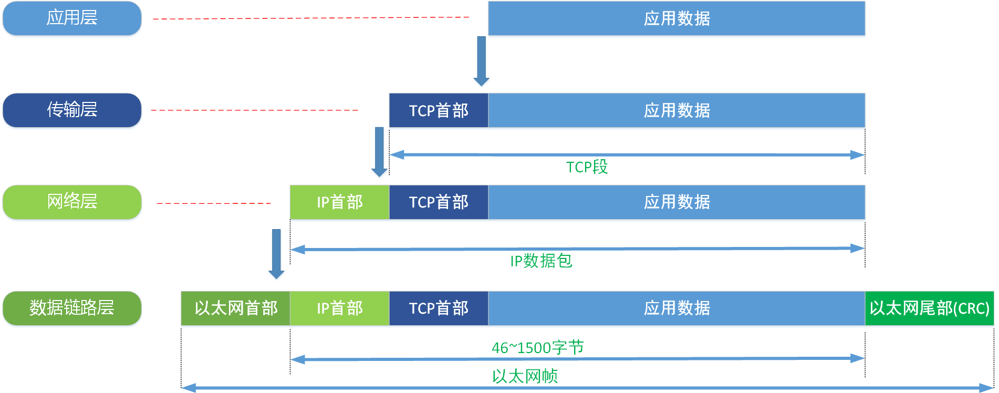

# 以太网帧

### 帧结构

在以太网链路上的数据包称作以太帧。以太帧起始部分由前导码和帧开始符组成。后面紧跟着一个以太网报头，
以MAC地址说明目的地址和源地址。帧的中部是该帧负载的*包含其他协议报头的数据包(例如IP协议)*。以太帧由一个32位冗余校验码结尾。
它用于检验数据传输是否出现损坏。

以太网上使用两种标准帧格式。第一种是上世纪80年代提出的DIX v2格式，即Ethernet II格式。第二种是1983年提出的IEEE 802.3格式。
两种格式得区别在于在目标和源MAC地址后面，Ethernet II 格式中是一个Type字段，标识以太网帧处理完之后将被发送到哪个上层协议进行处理，
IEEE 802.3格式同样位置是Length字段，标示data数据包的大小。

当Type字段值小于等于1500（0x05DC）时，帧使用的是IEEE 802.3格式。当Type字段值大于等于1536（0x0600）时，帧使用的是Ethernet II格式。

*DMAC*

> 目的MAC地址。字段长度6个字节，标识帧的接收者。

*SMAC*

> 源MAC地址。字段长度6个字节，标识帧的发送者。

*Type*

> 类型字段，字段长度2个字节，用于标识数据字段种包含的高层协议，IEEE802.3 和 Ethernet II 都有。
> * 0x0800 代表 IP协议帧
> * 0x0806 代表ARP协议帧

*Length*

> IEEE 802.3 专有，表明 Data 数据包大小，最小为46字节，最大1500字节。

*Data*

> 数据字段是网络层数据，最小长度必须为46字节。

*FCS*

> 循环冗余校验字段，提供了一种错误检测机制，字段长度为4个字节。

*LLC*

> 逻辑链路控制，由目的服务访问点DSAP（Destination Service Access Point）、源服务访问点SSAP（Source Service Access Point)和Control字段组成。

*SNAP*

> SNAP（Sub-network Access Protocol）由机构代码（Org Code）和类型Type字段组成。Org Code三个字节都为0。Type字段的含义与Ethernet II中Type字段相同。
  
抓包

### 帧封装

当我们应用程序用TCP传输数据的时候，数据被送入协议栈中，然后逐个通过每一层，知道最后到物理层数据转换成比特流，
送入网络。而再这个过程中，每一层都会对要发送的数据加一些首部信息。

如图可以看出，每一层数据是由上一层数据+本层首部信息组成的。

*应用层*

> PDU(协议数据单元) 数据。

*传输层*

> 在应用层数据上添加 TCP 头，封装后的数据成为 Segment(数据段)。

*网络层*

> 网络层添加IP报头得到的 Packet(数据包)。

*数据链路层*

> 封装数据链路层报头得到 Frame(数据帧)，称为以太网帧。

最后,帧被转换为比特,通过网络介质传输。 这种协议栈逐层向下传递数据,并添加报头和报尾的过程称为封装。

