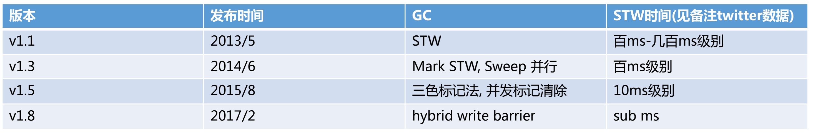
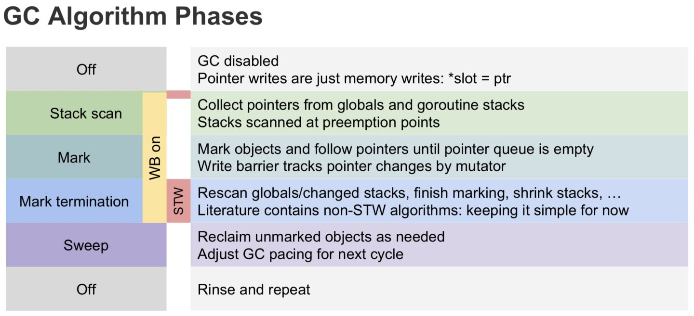
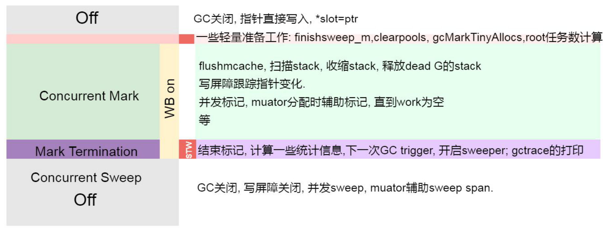

# Go 垃圾回收

### 简介

垃圾回收(Garbage Collection，简称GC)是编程语言中提供的自动的内存管理机制，自动释放不需要的对象，让出存储器资源，
无需程序员手动执行。

Golang 中的垃圾回收主要应用三色标记法，GC 过程和 goroutine 并发运行，但需要一定时间的 STW(stop the world)，
STW 的过程中，CPU 不执行用户代码。Golang 进行了多次的迭代优化来解决这个问题。

> v1.1 版本使用标记-清除的方式，整个过程需要 STW 。

> v1.3 版本分离了标记和清扫的操作，标记时 STW，清扫并发执行 。

> v1.5 版本标记过程中使用三色标记法，使用了 Dijkstra 插入写屏障。在开启 GC 时，需要短暂的 STW 来做准备工作(开启屏障等)，之后标记并发执行，
标记完成后需要 STW 一定时间来做 GC 收尾工作(关闭屏障等)，以及栈的重新扫描(比较耗时)，最后并发清除。

> v1.8 版本引入了混合写屏障机制(Dijkstra 插入写屏障、Yuasa的删除写屏障)，避免了对栈 re-scan 的过程，极大的减少了 STW 的时间。**

> v1.12 版本对 Mark Termination 进行了优化

### 标记-清扫算法

