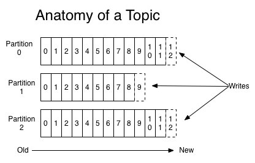

# 高性能 kafka

kafka 是由 Apache 软件基金会开发的一个开源流处理平台，由 Scala 和 Java 编写。
该项目的目标是为处理实时数据提供一个统一、高吞吐、低延迟的平台。
其持久化层本质上是一个“按照分布式事务日志架构的大规模发布/订阅消息队列”，
这使它作为企业级基础设施来处理流式数据非常有价值。

什么特性导致了 kafka 高性能表现？

### 顺序读写

kafka为啥用了磁盘，还速度快？

**顺序读写 vs 随机读取**

硬盘是机械结构，每次读写都会寻址->写入，其中寻址是一个“机械动作”，它是最耗时的。

而磁盘顺序读写，就避免了寻址动作，减少了寻址的开销。在顺序读写的情况下，磁盘的顺序读写速度和内存持平。

> 磁盘顺序读或写的速度400M/s，能够发挥磁盘最大的速度。
> 
> 随机读写，磁盘速度慢的时候十几到几百K/s。

kafka 将来自 producer 的数据，顺序追加在 partition ，partition 就是一个文件，以此实现顺序写入。

consumer 从 broker 读取数据时，因为自带了偏移量，接着上次读取的位置继续读，以此实现顺序读。

顺序读写，是kafka利用磁盘特性的一个重要体现。



这种方法有一个缺陷——没有办法删除数据 ，所以kafka是不会删除数据的,它会把所有的数据都保留下来。

但如果不删除硬盘肯定会被撑满，所以Kakfa提供了两种策略来删除数据：

> 一是基于时间；
>
> 二是基于partition文件大小。

### Zero Copy

零拷贝技术指在计算机执行操作时，CPU 不需要先将数据从一个内存区域复制到另一个内存区域，从而可以减少上下文切换以及 CPU 的拷贝时间。
它的作用是在数据报从网络设备到用户程序空间传递的过程中，减少数据拷贝次数，减少系统调用，实现 CPU 的零参与，彻底消除 CPU 在这方面的负载。

**mmap**

kafka 会把收到的消息都写入到硬盘中。为了优化写入速度，除了上面的`顺序读写`外，还用到了 `mmap` 。

传统实现方式

```
data = socket.read()// 读取网络数据 
File file = new File() 
file.write(data)// 持久化到磁盘 
file.flush()
```

从接收生产者消息，到数据写入磁盘，数据经历四次拷贝。


数据落盘通常都是非实时的，kafka 生产者数据持久化也是如此。Kafka 的数据`并不是实时的写入硬盘`，
它充分利用了现代操作系统分页存储来利用内存提高I/O效率。

mmap(Memory Mapped Files) 简称内存映射文件，工作原理是直接利用操作系统的 Page 来实现文件到物理内存的直接映射。
用户通过修改内存就能修改磁盘文件。目的就是减少上述拷贝的次数。

完成映射之后你对物理内存的操作会被同步到硬盘上（操作系统在适当的时候）。

通过mmap，进程像读写硬盘一样读写内存（当然是虚拟机内存），也不必关心内存的大小，有虚拟内存为我们兜底。

使用这种方式可以获取很大的I/O提升，省去了用户空间到内核空间复制的开销。不需要再把数据从内核缓存区拷贝到用户缓存。
读取到socket buffer的网络数据后，应用进程不需要中间处理，直接在OS内核缓冲区，完成落盘。避免数据拷贝。

但也有一个很明显的缺陷——不可靠，写到mmap中的数据并没有被真正的写到硬盘，操作系统会在程序主动调用flush的时候才把数据真正的写到硬盘。

kafka 提供了一个参数 producer.type 来控制是不是主动 flush 。如果 kafka 写入到 mmap 之后就立即 flush 然后再返回 producer 叫同步 (sync)；
写入 mmap 之后立即返回 producer 不调用 flush 叫异步 (async)。

**sendfile**

kafka 会把收到的消息通过网络发送，传统方式先读取磁盘、再用 socket 发送，实际也是进过四次 copy。

```
buffer = File.read 
Socket.send(buffer)
```

> 调用read函数，文件数据被copy到内核缓冲区
> 
> read函数返回，文件数据从内核缓冲区copy到用户缓冲区
>
> write函数调用，将文件数据从用户缓冲区copy到内核与socket相关的缓冲区
>
> 数据从socket缓冲区copy到相关协议引擎

Linux 2.4+ 内核通过 sendfile 系统调用，提供了零拷贝。数据通过 DMA 拷贝到内核态 Buffer 后，
直接通过 DMA 拷贝到 NIC Buffer，无需 CPU 拷贝。这也是零拷贝这一说法的来源。
除了减少数据拷贝外，因为整个读文件 - 网络发送由一个 sendfile 调用完成，整个过程只有两次上下文切换，
因此大大提高了性能。

kafka 在这里采用的方案是通过 NIO 的 transferTo/transferFrom 调用操作系统的 sendfile 实现零拷贝。
总共发生 2 次内核数据拷贝、2 次上下文切换和一次系统调用，消除了 CPU 数据拷贝。

kafka把所有的消息都存放在一个一个的文件中，当消费者需要数据的时候Kafka直接把文件发送给消费者，配合mmap作为文件读写方式，直接把它传给sendfile。


