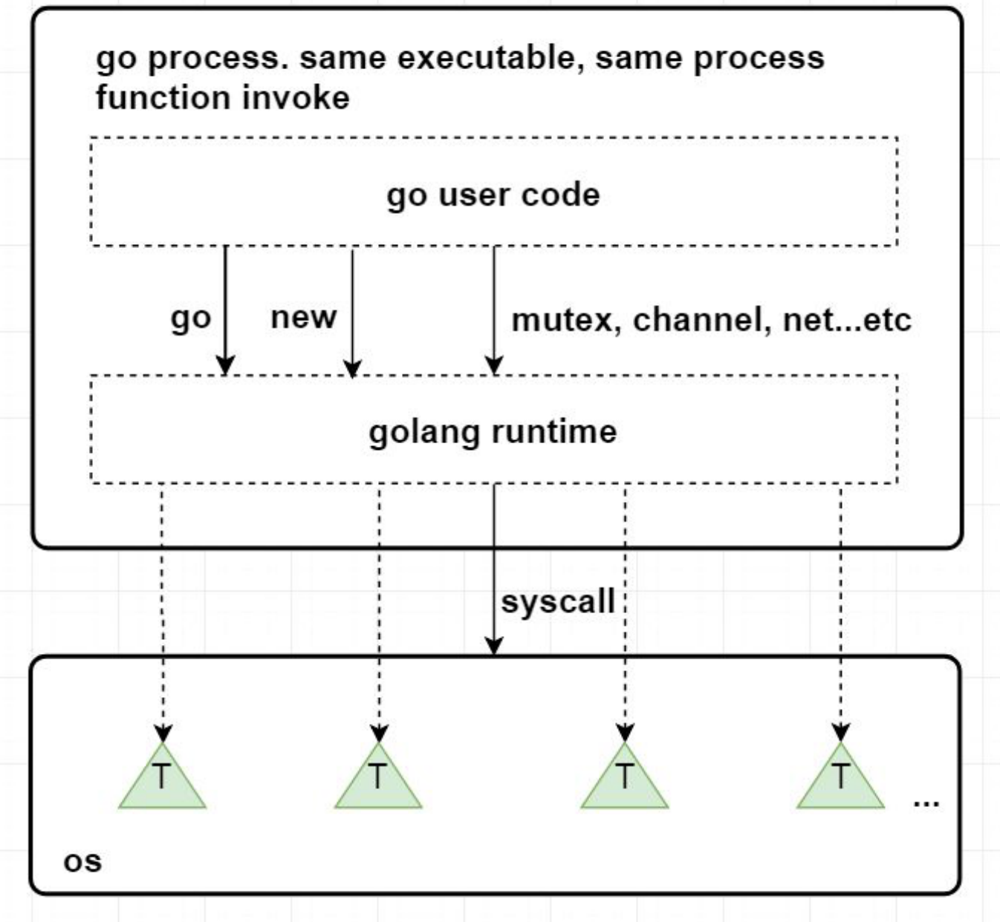
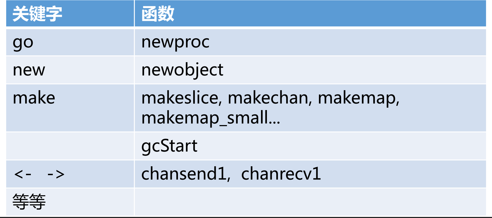
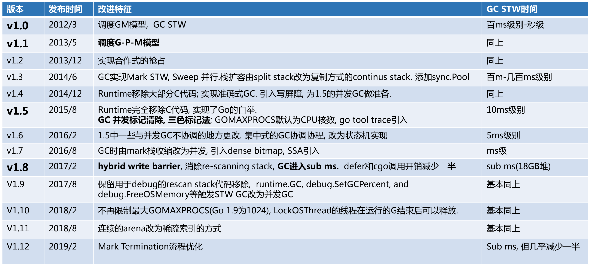

# Golang Runtime

Golang Runtime 是 Go 语言运行所需要的基础设施。

**负责操作**

* 协程调度、内存分配、GC；

* 操作系统及CPU相关操作的封装(信号处理，系统调用，寄存器操作，原子操作等)、CGO；

* pprof、trace、race检测的支持；

* map、channel、string等内置类型及反射的实现。

与Java、Python不同，Go并没有虚拟机的概念，runtime 也直接被编译成 native code，与用户代码一起打包到一个可执行文件当中。

用户代码与 runtime 代码在执行的时候并没有明显的界限，都是函数调用。

Go 对系统调用的指令进行了封装，可不依赖glibc。一些关键字被编译成 runtime 包下的函数。

**发展历程**

