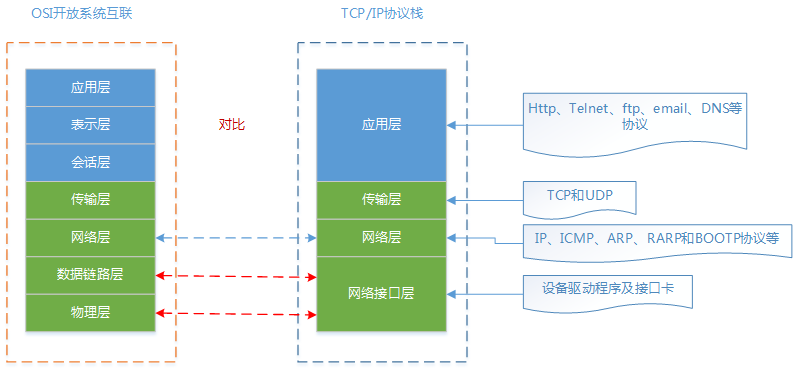
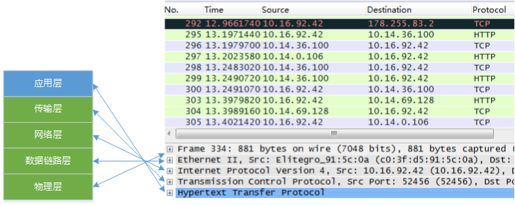
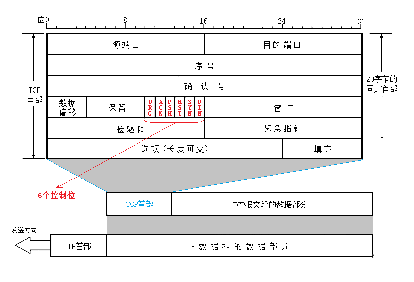
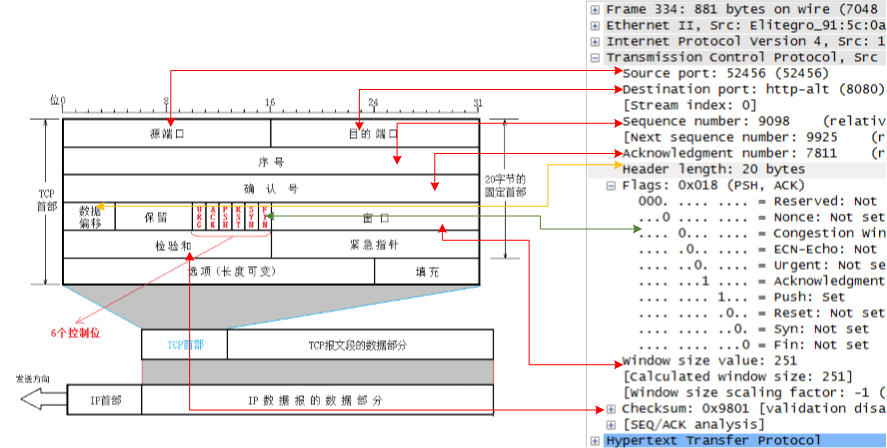
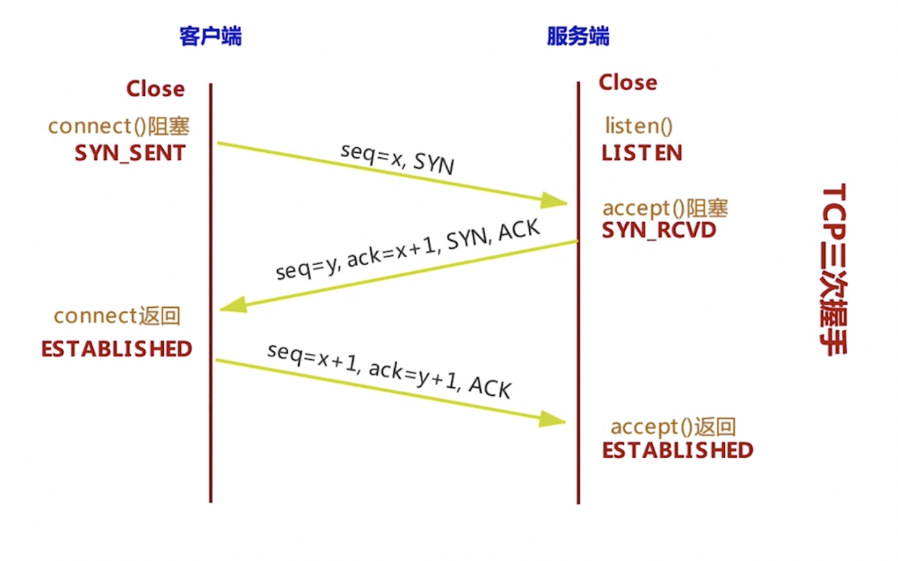

# TCP/IP 协议

TCP/IP（TCP/IP Protocol Suite）是一个协议族，包含两个核心协议：TCP（传输控制协议）和IP（网际协议），类似计算机科学中的堆栈，因此又被称为TCP/IP协议栈。

OSI(Open System Interconnection Reference Model)七层模型，一种概念模型，由国际标准化组织提出，一个试图使各种计算机在世界范围内互连为网络的标准框架。

OSI只是一种设计概念，而TCP/IP四层模型是在实际中应用的模型。

**应用层**

> 大多数普通与网络相关的程序为了通过网络与其他程序通信所使用的层。这个层的处理过程是应用特有的；
> 数据从网络相关的程序以这种应用内部使用的格式进行传送，然后被编码成标准协议的格式。
>
> 应用层负责处理特定的应用程序细节。包括Telnet（远程登录）、FTP（文件传输协议）、SMTP（简单邮件传送协议）以及SNMP（简单网络管理协议）等。

**传输层**

> 两台主机上的应用程序提供端到端的通信，有2种传输协议：TCP（传输控制协议）和UDP（用户数据报协议）。
>
> TCP为两台主机提供高可靠性的数据通信。包括把应用程序交给它的数据分成合适的小块交给下面的网络层，确认接收到的分组，
> 设置发送最后确认分组的超时时钟等。
>
> UDP为提供一种非常简单的服务。它只是把称作数据报的分组从一台主机发送到另一台主机，但并不保证该数据报能到达另一端。
> 任何必须的可靠性必须由应用层来提供。

**网络层**

> 处理分组在网络中的活动，例如分组的选路。网络层协议包括IP协议（网际协议）、ICMP协议（Internet互联网控制报文协议），以及IGMP协议（Internet组管理协议）。

**数据接口层**

> 也称作数据链路层，包括操作系统中的设备驱动程序和计算机中对应的网络接口卡。一起处理与电缆（或其他任何传输媒介）的物理接口细节。

**包分析**

> Frame：物理层的数据帧概况
>
> Ethernet II：数据链路层以太网帧头部信息
>
> Internet Protocol Version 4：互联网层IP包头部信息
>
> Transmission Control Protocol：传输层的数据段头部信息，此处是TCP
>
> Hypertext Transfer Protocol：应用层的信息，此处是HTTP协议
 
[以太网帧的封装](https://github.com/lzle/note/tree/master/doc/frame)

### TCP

TCP是一种面向连接（连接导向）的、可靠的基于字节流的传输层通信协议。TCP将用户数据打包成报文段，它发送后启动一个定时器，
另一端收到的数据进行确认、对失序的数据重新排序、丢弃重复数据。

**源/目的端口**

> 源端口和目的端口，每个占用16bit，端口范围为0-65535。

**序号**

> 在建立连接时由计算机生成的随机数作为其初始值，通过 SYN 包传给接收端主机，每发送一次数据，
> 就「累加」一次该「数据字节数」的大小。用来解决网络包乱序问题。

**确认序号**

> 指下一次「期望」收到的数据的序列号，发送端收到这个确认应答以后可以认为在这个序号以前的数据都已经被正常接收。
> 用来解决不丢包的问题。

**首部长度**

> TCP 头部的长度，一般首部长度为20字节。

**标志位**

> URG表示报文段中有紧急数据，应尽快传送;
>
> ACK消息确认；
>
> PSH表示数据负载发送，接收端尽快的交付给应用进程；
> 
> RTS表示TCP连接中出现严重差错，必须释放连接，再重新建立连接；
>
> SYN表示请求建立一个连接；
> 
> FIN表示通知对方要关闭连接；

**窗口**

> 这是TCP流量控制的一个手段。此处的窗口指的是接收通告窗口，用于告诉对方本端的TCP接收缓冲区还能容纳多少字节的数据，这样对方就可以控制发送数据的速度。

**校验和**

> 该字段检验的范围包括首部和数据这两部分。由发端计算和存储，并由收端进行验证。

**选项**

> 长度可变，最长可达40字节。

**包分析**

**TCP 三次握手**

**TCP 四次挥手**

