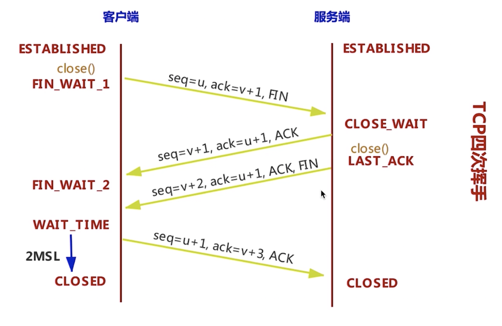
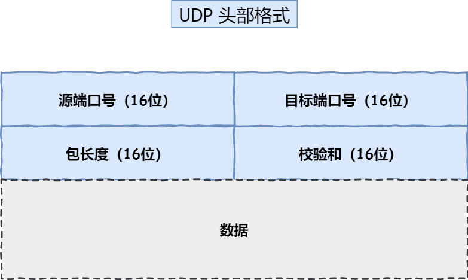

# TCP/IP 协议

TCP/IP（TCP/IP Protocol Suite）是一个协议族，包含两个核心协议：TCP（传输控制协议）和IP（网际协议），类似计算机科学中的堆栈，因此又被称为TCP/IP协议栈。

OSI(Open System Interconnection Reference Model)七层模型，一种概念模型，由国际标准化组织提出，一个试图使各种计算机在世界范围内互连为网络的标准框架。

OSI只是一种设计概念，而TCP/IP四层模型是在实际中应用的模型。

**应用层**

> 大多数普通与网络相关的程序为了通过网络与其他程序通信所使用的层。这个层的处理过程是应用特有的；
> 数据从网络相关的程序以这种应用内部使用的格式进行传送，然后被编码成标准协议的格式。
>
> 应用层负责处理特定的应用程序细节。包括Telnet（远程登录）、FTP（文件传输协议）、SMTP（简单邮件传送协议）以及SNMP（简单网络管理协议）等。

**传输层**

> 两台主机上的应用程序提供端到端的通信，有2种传输协议：TCP（传输控制协议）和UDP（用户数据报协议）。
>
> TCP为两台主机提供高可靠性的数据通信。包括把应用程序交给它的数据分成合适的小块交给下面的网络层，确认接收到的分组，
> 设置发送最后确认分组的超时时钟等。
>
> UDP为提供一种非常简单的服务。它只是把称作数据报的分组从一台主机发送到另一台主机，但并不保证该数据报能到达另一端。
> 任何必须的可靠性必须由应用层来提供。

**网络层**

> 处理分组在网络中的活动，例如分组的选路。网络层协议包括IP协议（网际协议）、ICMP协议（Internet互联网控制报文协议），以及IGMP协议（Internet组管理协议）。

**数据接口层**

> 也称作数据链路层，包括操作系统中的设备驱动程序和计算机中对应的网络接口卡。一起处理与电缆（或其他任何传输媒介）的物理接口细节。

**包分析**

> Frame：物理层的数据帧概况
>
> Ethernet II：数据链路层以太网帧头部信息
>
> Internet Protocol Version 4：互联网层IP包头部信息
>
> Transmission Control Protocol：传输层的数据段头部信息，此处是TCP
>
> Hypertext Transfer Protocol：应用层的信息，此处是HTTP协议
 
[以太网帧的封装](https://github.com/lzle/note/tree/master/doc/frame)

***

### TCP协议

TCP是一种面向连接（连接导向）的、可靠的基于字节流的传输层通信协议。TCP将用户数据打包成报文段，它发送后启动一个定时器，
另一端收到的数据进行确认、对失序的数据重新排序、丢弃重复数据。

**源/目的端口**

> 源端口和目的端口，每个占用16bit，端口范围为0-65535。

**序号**

> 在建立连接时由计算机生成的随机数作为其初始值，通过 SYN 包传给接收端主机，每发送一次数据，
> 就「累加」一次该「数据字节数」的大小。用来解决网络包乱序问题。

**确认序号**

> 指下一次「期望」收到的数据的序列号，发送端收到这个确认应答以后可以认为在这个序号以前的数据都已经被正常接收。
> 用来解决不丢包的问题。

**首部长度**

> TCP 头部的长度，一般首部长度为20字节。

**标志位**

> URG表示报文段中有紧急数据，应尽快传送;
>
> ACK消息确认；
>
> PSH表示数据负载发送，接收端尽快的交付给应用进程；
> 
> RTS表示TCP连接中出现严重差错，必须释放连接，再重新建立连接；
>
> SYN表示请求建立一个连接；
> 
> FIN表示通知对方要关闭连接；

**窗口**

> 这是TCP流量控制的一个手段。此处的窗口指的是接收通告窗口，用于告诉对方本端的TCP接收缓冲区还能容纳多少字节的数据，这样对方就可以控制发送数据的速度。

**校验和**

> 该字段检验的范围包括首部和数据这两部分。由发端计算和存储，并由收端进行验证。

**选项**

> 长度可变，最长可达40字节。

**包分析**

**TCP 三次握手**

**TCP 四次挥手**

***
### UDP协议

UDP 不提供复杂的控制机制，利用 IP 提供面向「无连接」的通信服务。

UDP 协议真的非常简，头部只有 8 个字节（ 64 位）。

**目标和源端口**

> 主要是告诉 UDP 协议应该把报文发给哪个进程。

**包长度**

> 保存了 UDP 首部的长度跟数据的长度之和。

**校验和**

> 校验和是为了提供可靠的 UDP 首部和数据而设计。

如果接收方UDP发现收到的报文中的目的端口号不正确（不存在对应端口号的应用进程0,），就丢弃该报文，并由ICMP发送“端口不可达”差错报文给对方。

### TCP 与 UDP 区别

**连接**

> TCP 是面向连接的传输层协议，传输数据前先要建立连接。
> UDP 是不需要连接，即刻传输数据。

**服务对象**

> TCP 是一对一的两点服务，即一条连接只有两个端点。
> UDP 支持一对一、一对多、多对多的交互通信。

**可靠性**

> TCP 是可靠交付数据的，数据可以无差错、不丢失、不重复、按需到达。
> UDP 是尽最大努力交付，不保证可靠交付数据。

**拥塞控制、流量控制**

> TCP 有拥塞控制和流量控制机制，保证数据传输的安全性。
> UDP 则没有，即使网络非常拥堵了，也不会影响 UDP 的发送速率。

**首部开销**

> TCP 首部长度较长，会有一定的开销，首部在没有使用「选项」字段时是 20 个字节，如果使用了「选项」字段则会变长的。
> UDP 首部只有 8 个字节，并且是固定不变的，开销较小。

***

### IP协议

IP协议输入网络层，甭管是TCP、UDP还是ICMP都是在IP协议头后面的数据部分。IPv4的头部结构长度为20字节，
若含有可变长的选项部分，最多60字节。

**版本**

> IP协议的版本号。

**头长度**

> IP Header Length，IP头的长度。Total Length减去它就是数据的长度。

**服务类型**
> 3位优先权字段(现已被忽略) + 4位TOS字段 + 1位保留字段(须为0)。4位TOS字段分别表示最小延时、最大吞吐量、最高可靠性、最小费用，其中最多有一个能置为1。应用程序根据实际需要来设置 TOS值，如ssh和telnet这样的登录程序需要的是最小延时的服务，文件传输ftp需要的是最大吞吐量的服务。

**总长度**
> IP数据报的总长度，单位为字节，即IP数据报的最大长度为65535字节(2的16次方)。由于MTU的限制，长度超过MTU的数据报都将被分片传输，所以实际传输的IP分片数据报的长度远远没有达到最大值
>
> 如果包超过网络最大传输单元，那么需要对包进行拆分，接下来的三个字段就是用来拆包的。

**标识**
> 唯一的标识主机发送的每一个数据报，其初始值是随机的，每发送一个数据报其值就加1。同一个数据报的所有分片都具有相同的标识值。

**标志**
> 位1保留。位2表示禁止分片，若设置此位表明不进行分包。位3表明更多分片，除了数据包最后一个分片，其他分片都设置为1。

**分片偏移**
> 分片相对原始IP数据报数据部分的偏移。实际的偏移值为该值左移3位后得到的，所以除了最后一个IP数据报分片外，每个IP分片的数据部分的长度都必须是8的整数倍。

**TTL**
> 路由的跳数，防止路由死循环。

**协议**
> 区分IP协议的上层协议。ICMP为1，TCP为6，UDP为17。Linux文件/etc/protocols中有所有协议对应的数值。

**头部校验和**
> 检查IP报位在传输过程中是否有修改和损坏。

**Options**
> 可变长的可选信息，最多包含40字节。选项字段很少被使用

**Padding**
> 补齐

